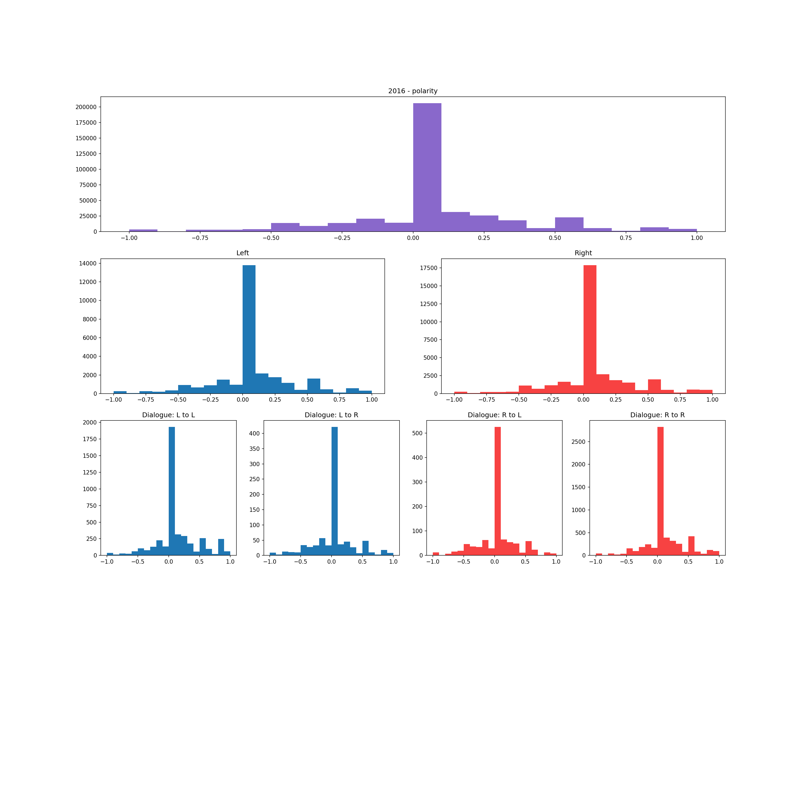

# Introduction

# The Data

# Our Approach
### Identifying the Political Left and Right

### Sentiment Analysis

### Permutation Testing

# Findings

For more details see our project's [GitHub repository](https://github.com/hbpeters/2016-2020_elections_on_twitter)   
Project site: [hbpeters.github.io/2016-2020_pres_elections_twitter](https://hbpeters.github.io/2016-2020_pres_elections_twitter/)
