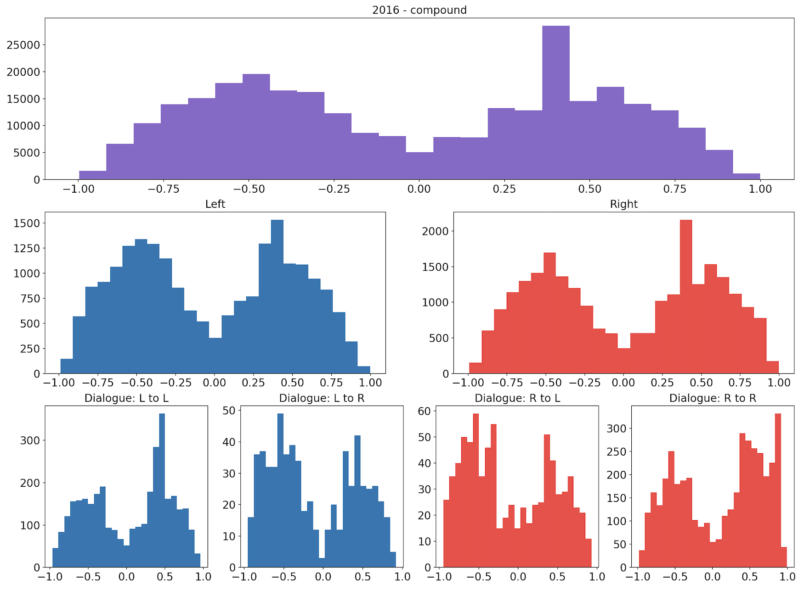
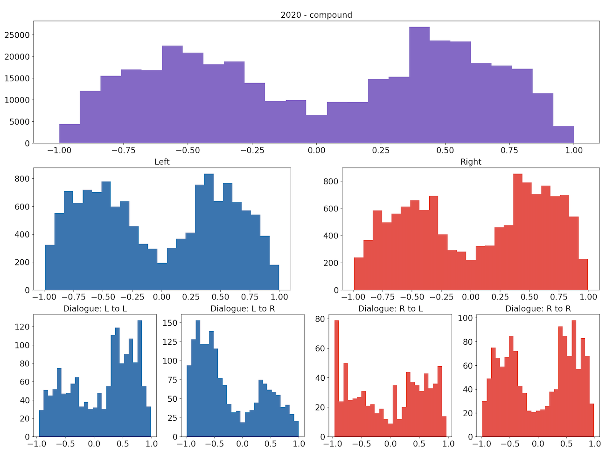
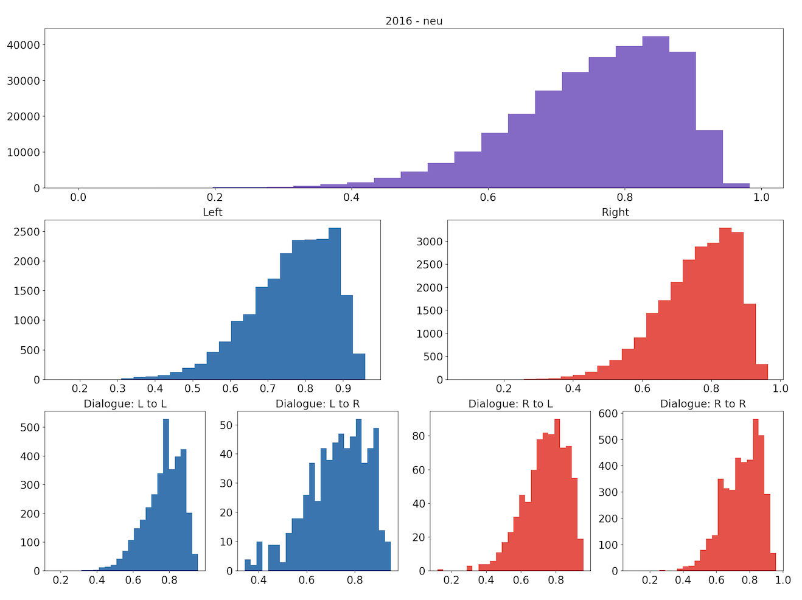
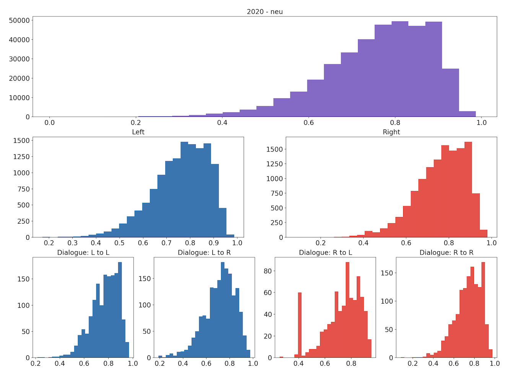
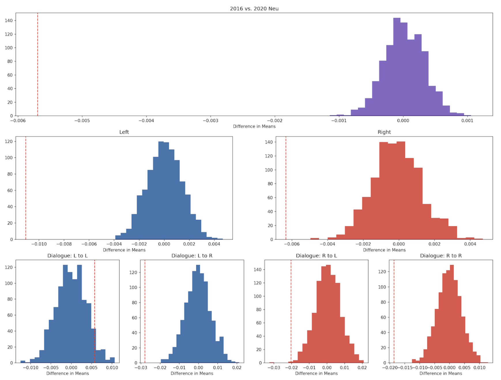

# Introduction
The 2020 presidential election in the United States was polarizing for the American people, perhaps even historically so, as Americans grappled with casting their votes for Joe Biden or President Donald Trump in light of major events that took place in 2020, including the onset of the COVID-19 pandemic at the beginning of the year and the racial protests and riots sparked by the murder of George Floyd at the hands of the police in May. Happenings such as these have led the American people to regard the year 2020 as generally negative—it was common to hear statements in the media and amongst peers such as “2020 is the worst year ever” or “I just want 2020 to be over.” There is also talk amongst the media and general public that, politically, Americans are “more divided than ever,” largely in reference to conflicting opinions about Donald Trump’s controversial presidency. 

We are curious if there is empirical evidence of Americans’ attitudes towards politics becoming increasingly negative and polarized as suggested by these common sentiments, and how attitudes between and within political parties may have shifted in recent years. To do this, we analyze Twitter data related to the 2016 and 2020 presidential elections, specifically, as Twitter has become a popular platform for voters and candidates to express their opinions and exchange information, and the elections offer two distinct political events to measure change between. In this investigation, we develop a method of assigning political leanings to Twitter users and perform sentiment analysis and permutation testing on different groups of tweets between the two election years to assess if there are stasticially significant shifts in sentiment from 2016 to 2020, hypothesizing that tweets have become more negative and less neutral between the two years.

# The Data
We use two different datasets of tweets in this investigation, one for each election. The [2016 dataset](https://dataverse.harvard.edu/dataset.xhtml?persistentId=doi:10.7910/DVN/PDI7IN) was collected by researchers at Harvard and the [2020 dataset](https://github.com/echen102/us-pres-elections-2020) was collected by researchers at USC. Both groups collected tweets by tracking accounts and keywords affiliated with the elections using Twitter’s API. Each raw dataset consists of text files of tweet IDs. A tweet ID is a numerical identifier associated with a specific tweet, the full information of which is retrieved in process called “hydration” using a tool called [Twarc](https://github.com/DocNow/twarc) that is linked to Twitter’s API. Twarc returns the full information for tweets in json format, and each hydrated tweet contains data fields such as the full text of the tweet, the hashtags it uses, the users it mentions, if it was an original tweet or retweet, etc., as well as information about the Twitter user who authored the tweet.

To maintain uniformity for sentiment analysis, we filter out tweets in languages other than English. Also, the two datasets were collected by different groups that used different keyword searches to gather election-related tweets, so for our analysis to not be affected by this, we had to unify them under a universal keyword search. The keyword search used for the 2020 dataset was broader than that used for the 2016 dataset, so we filter the 2020 dataset using the 2016 keywords, changing the names of the candidates to align with the 2020 election. Our final datasets consist of 414,713 tweets from 2016 and 500,000 tweets from 2020.

# Our Approach
### Identifying the Political Left and Right
We have two ways of assigning political leanings to tweets: if they were authored by partisan news sources or politicians, or if they use politically-charged hashtags. For the first way, we made lists of right- and left-leaning Twitter accounts of partisan news sources by selecting those that are determined to be far-left or far-right according to statistical analysis of popular news outlets performed by [AllSides.com](https://www.allsides.com/media-bias/media-bias-ratings). For the politicians, we add to these lists the Twitter accounts of all of the candidates listed on the 2016 and 2020 Democratic and Republican Party presidential primaries’ Wikipedia pages. So with this, we had lists of relatively influential Twitter users whose political leanings are well-defined. 

For the second way of identifying left- and right-leaning tweets, we referred to their hashtag usage. We hand-picked clearly left- and clearly right-leaning hashtags among commonly used hashtags within the sets of tweets for both years. For 2016, for example, left-leaning hashtags included "voteblue" and "donthecon" and right-leaning hashtags included "maga" and "lockherup". Then, for each year, we made left and right subsets of tweets by selecting ones that included at least one hashtag from the respective lists, excluding those that include hashtags from both lists. We then made lists of right- and left-leaning users by collecting the screen-names from each subset and combined these with the lists of politicians and partisan news sites accounts. Then we gathered all of the tweets from the datasets authored by these accounts to get our final left- and right-leaning subsets of tweets.

After assigning political leanings to some of the users, we identified “dialogue” happening between and within the left and right political spheres by analyzing the tweets’ user mentions.  We classified the dialogue occurring as either L-L, L-R, R-L, or R-R depending on the leaning of the author of the tweet and that of the user(s) they mention. For example, if a tweet was authored by a left-leaning user and mentions one or more right-leaning users, it was classified as being an instance of L-R dialogue. These subsets of dialogue gave us a way of narrowing down where shifts in sentiment might have occurred between 2016 and 2020—for example, we could see if attitudes among the left towards the right became more negative or if they directed more “charged” language towards them, and vice versa.

### Sentiment Analysis
The following sets of plots for each year show the distributions of compound scores for all tweets, for the left and right subsets we identified, and for the 4 types of dialogue we idenitifed. We can see that the distributions appear very similar, both between the groups for each year and across the two years. 

Similarly, the following sets of plots show how the tweets' neutrality scores are distributed.

Visually, the distributions of both the compound and neutrality scores are similar across the different groupings. We conduct permutation testing to determine if there are statistically significant differences between distributions across the two years.

### Permutation Testing

To determine if the results of our sentiment analysis were statistically significant, we conducted permutation tests on the differences in mean compound score and neutrality between 2020 and 2016 for different groupings of our data: the data overall; the left and right subsets; and the left-left, left-right, right-left and right-right dialogue subsets. We stated that the null hypothesis was that there was no change in the compound score or neutrality score between the two years. Using the mean as the test statistic, we calculated the observed difference, randomly sampled the two distrobutions, and found the resulting p values.

The following plots show the distrbution of the difference of means for the compound scores.

Similarly, the following plots how the distrbution of the difference of means for the neutrality scores.

# Conclusions

In conclusion, we found that the 2020 tweets were actually overwhelmingly more positive and less neutral when compared to the 2016 tweets. This disproves our hypothesis which stated that between 2016 and 2020, there will be an overall shift towards a more negative sentiment and less neutrality. Specifcally between left-leaning users who mentioned right-leaning users, there was a noticeable decrease in nuetrality and increase in negative sentiment. We can conclude that there seems to be an increase in political polarization and negative feelings from those who are left-identified to those who are right-identified, and this is reflected in stronger and more politically-charged tweets. Interestingly, the dialogue between right-leaning users who mention left-leaning users became more positive between the two cycles, indicating that although the left-leaning users might have interacted with the right more aggressively it is not the same vice versa. In addition, the dialogue within left users demonstrated a more positive shift, but that within right users became more negative, indicating that we can’t make conclusive statements in terms of the sentiment shift within a certain political party, but perhaps there was more optimism within the left-leaning users with the new hope that came with the new election cycle, and more worry or pessimism within the right-leaning users. Overall, although there was an general positive shift of tweets regarding the election between the two cycles, we were able to gain interesting insights by examining the dialogue between users and the two groups.

# Future Work

For more details see our project's [GitHub repository](https://github.com/hbpeters/2016-2020_elections_on_twitter)   
Project site: [hbpeters.github.io/2016-2020_pres_elections_twitter](https://hbpeters.github.io/2016-2020_pres_elections_twitter)
